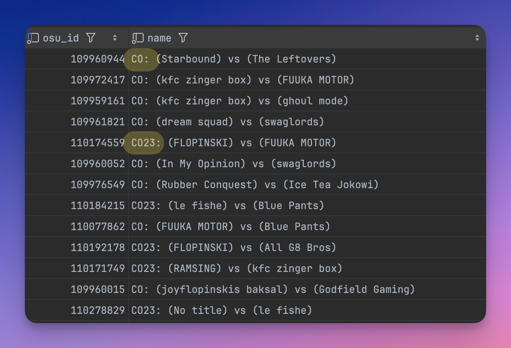

The [[Platform Architecture#data worker|Data worker]] has numerous responsibilities, one of them being a data processing step known as automated checks. These checks are responsible for identifying, flagging, and in some cases fixing various discrepancies found in our data.

## Processing Order

Automated checks are performed in a bottom-up hierarchical order. Child entities are processed before their parents so that parent entities have full context of how their children fared during the automated checks process.

1. Score checks
1. Game checks
1. Match checks
1. Tournament checks

## Score Checks

Each score in each game is evaluated against the following checks in order.

1. **Minimum Score**: If score value ≤ 1,000, apply `ScoreBelowMinimum` rejection. Otherwise, proceed.
1. **Invalid Mods**: If score contains SuddenDeath, Perfect, Relax, Autoplay, or Relax2 mods, apply `InvalidMods` rejection. Otherwise, proceed.
1. **Ruleset Match**: If score ruleset differs from tournament ruleset, apply `RulesetMismatch` rejection. Otherwise, proceed.
1. **Status Assignment**: If no rejection reasons were applied, set status to `PreVerified`. Otherwise, set to `PreRejected`.

## Game Checks

Each game in each match is evaluated against the following checks in order.

1. **Beatmap Usage**: If beatmap is null, skip to the next check. If tournament has a known pool and beatmap is not in the pool, apply `BeatmapNotPooled` rejection. If no pool is defined and the beatmap appears exactly once across the tournament, apply `BeatmapUsedOnce` warning.
1. **End Time**: If end time is null, unparseable, or ≤ Unix epoch (1970-01-01), apply `NoEndTime` rejection. Otherwise, proceed.
1. **Invalid Mods**: If game contains SuddenDeath, Perfect, Relax, Autoplay, or Relax2 mods, apply `InvalidMods` rejection. Otherwise, proceed.
1. **Ruleset Match**: If game ruleset differs from tournament ruleset, apply `RulesetMismatch` rejection. Otherwise, proceed.
1. **Score Counts**: If total score count is 0, apply `NoScores` rejection. If valid score count is 0, apply `NoValidScores` rejection. If valid score count is odd or does not match lobby size requirements, apply `LobbySizeMismatch` rejection. Otherwise, proceed. Valid scores are scores which are PreVerified or Verified.
1. **Scoring Type**: If scoring type is not ScoreV2 or Lazer, apply `InvalidScoringType` rejection. Otherwise, proceed.
1. **Team Type**: If team type is not TeamVs or HeadToHead, apply `InvalidTeamType` rejection. Otherwise, proceed.
1. **Status Assignment**: If no rejection reasons were applied, set status to `PreVerified`. Otherwise, set to `PreRejected`.

## Match Checks

Each match is evaluated against the following checks. Warning checks are applied first, followed by rejection checks.

### Warning Checks

1. **Unexpected Beatmaps**: If games beyond the first 2 (sorted by start time) have `BeatmapNotPooled` rejection, apply `UnexpectedBeatmapsFound` warning.
1. **Name Format**: If match name does not match pattern `(Team) vs. (Team)`, apply `UnexpectedNameFormat` warning.
1. **Roster Integrity**: If players appear on both team rosters across valid games, apply `OverlappingRosters` warning.

### Rejection Checks

1. **End Time**: If end time is null or ≤ Unix epoch (1970-01-01), apply `NoEndTime` rejection. Otherwise, proceed.
1. **Game Counts**: If total game count is 0, apply `NoGames` rejection. If valid game count is 0, apply `NoValidGames` rejection. If valid game count < 3, apply `UnexpectedGameCount` rejection. If valid game count is 3-4, apply `LowGameCount` warning in addition to passing.
1. **Name Prefix**: If match name does not start with tournament abbreviation (case-insensitive), apply `NamePrefixMismatch` rejection. Otherwise, proceed.

### Head-to-Head Conversion

For 1v1 tournaments (lobby size = 1), the system attempts to convert HeadToHead games to TeamVs format.

1. **Eligibility**: Only runs if tournament lobby size is 1 and the match is played in Head-to-Head.
1. **Validation**: Requires exactly 2 unique players across all match games, with each game having 1-2 valid scores.
1. **Conversion**: Assigns Red/Blue teams based on player IDs and converts eligible HeadToHead games to TeamVs.
1. **Failure**: If validation fails, apply `FailedTeamVsConversion` rejection to the match and affected games.

### Status Assignment

If no rejection reasons were applied, set status to `PreVerified`. Otherwise, set to `PreRejected`.

## Tournament Checks

The tournament is evaluated against the following checks in order.

1. **Match Existence**: If no matches with games exist, apply `NoVerifiedMatches` rejection. Otherwise, proceed.
1. **Verified Match Count**: If no matches are PreVerified or Verified, apply `NoVerifiedMatches` rejection. Otherwise, proceed.
1. **Verification Threshold**: If the ratio of verified matches to total matches with games is < 80%, apply `NotEnoughVerifiedMatches` rejection. Otherwise, proceed.
1. **Status Assignment**: If no rejection reasons were applied, set status to `PreVerified`. Otherwise, set to `PreRejected`.

## Rejection Reasons Reference

| Entity | Rejection Reason | Trigger Condition |
|--------|------------------|-------------------|
| Score | `ScoreBelowMinimum` | Score value ≤ 1,000 |
| Score | `InvalidMods` | Contains SuddenDeath, Perfect, Relax, Autoplay, or Relax2 |
| Score | `RulesetMismatch` | Ruleset differs from tournament |
| Game | `BeatmapNotPooled` | Beatmap not in tournament pool (when pool exists) |
| Game | `NoEndTime` | End time is null or ≤ Unix epoch |
| Game | `InvalidMods` | Contains SuddenDeath, Perfect, Relax, Autoplay, or Relax2 |
| Game | `RulesetMismatch` | Ruleset differs from tournament |
| Game | `NoScores` | Zero scores present |
| Game | `NoValidScores` | Zero PreVerified or Verified scores |
| Game | `LobbySizeMismatch` | Valid score count is odd or does not match lobby size |
| Game | `InvalidScoringType` | Not ScoreV2 or Lazer |
| Game | `InvalidTeamType` | Not TeamVs or HeadToHead |
| Game | `FailedTeamVsConversion` | H2H conversion failed (applied during match processing) |
| Match | `NoEndTime` | End time is null or ≤ Unix epoch |
| Match | `NoGames` | Zero games present |
| Match | `NoValidGames` | Zero PreVerified or Verified games |
| Match | `UnexpectedGameCount` | 1-2 valid games (< 3 required) |
| Match | `NamePrefixMismatch` | Match name does not start with tournament abbreviation |
| Match | `FailedTeamVsConversion` | H2H conversion failed (wrong player count or unexpected players) |
| Tournament | `NoVerifiedMatches` | No matches with games or no verified matches |
| Tournament | `NotEnoughVerifiedMatches` | Verified match ratio < 80% |

## Warning Flags Reference

| Entity | Warning Flag | Trigger Condition |
|--------|--------------|-------------------|
| Game | `BeatmapUsedOnce` | Beatmap appears only once in tournament (no pool defined) |
| Match | `LowGameCount` | 3-4 valid games |
| Match | `UnexpectedBeatmapsFound` | Non-pooled beatmaps in games after the first 2 |
| Match | `UnexpectedNameFormat` | Match name does not follow `(Team) vs. (Team)` pattern |
| Match | `OverlappingRosters` | Same player appears on both team rosters |

## Status Transitions

| Current Status | Action | New Status |
|----------------|--------|------------|
| None | All checks pass | PreVerified |
| None | Any check fails | PreRejected |
| PreVerified | Manual approval | Verified |
| PreRejected | Manual rejection | Rejected |
| PreRejected | Manual override | Verified |

> [!note]
> Entities with `Verified` or `Rejected` status are locked and will not be re-processed by automated checks unless explicitly overridden.

## FAQ

### How can a human manually mark all entities as Verified?

Most of the manual review process occurs at the `Match` and `Game` levels. For example, if a `Match` has too many invalid games, it will be marked as `PreRejected` and require manual intervention. The same is true for `Game`s.

For `GameScore` entities, there are concrete rules which determine whether it should be `PreRejected`, for example if the `Score` value is below the minimum (and thus very likely comes from a referee in the lobby or other anomaly). It is rare for a `GameScore`'s `PreRejected` flag to be manually overturned.

Additionally, a web interface exists which allows reviewers to mark an entity - and all of its children - as `Verified` or `Rejected`. Generally speaking, if at a glance everything is marked as `PreVerified`, little effort is required to manually approve these submissions as they can be approved in one click.

### In what cases should a human reviewer override a PreRejected status?

One example of where this should happen is [Corsace Open 2023](https://osu.ppy.sh/community/forums/topics/1794106?n=1). This tournament has numerous matches marked as `PreRejected` by the system due to not having matches which consistently use the same prefix. This is a case in which the human reviewer should manually override the system's `PreRejected` status (assuming the `RejectionReason`s are of type `MatchRejectionReason.NamePrefixMismatch`).

More comprehensive considerations for various rejection reasons are documented on the [[Data Verification|Data Verification]] page.
