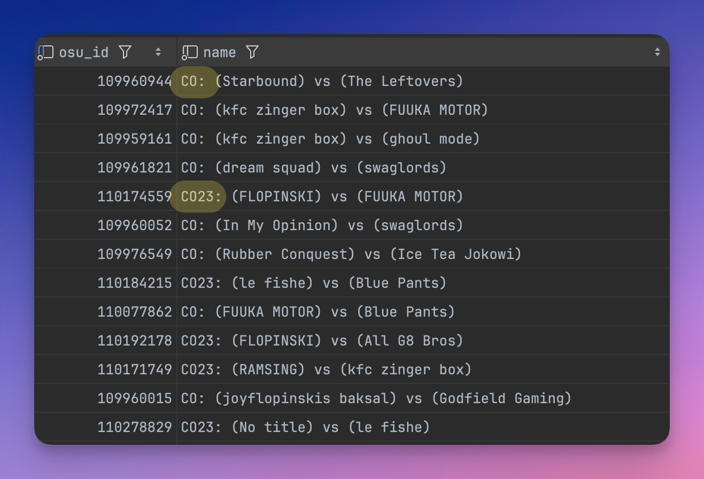

# Automated Checks

The [DataWorkerService](DataWorkerService.md) has numerous responsibilities, one of them being a data processing step known as automated checks. These checks are responsible for processing various portions of data depending on the current processing step for a particular piece of data.

## Core Principals

When designing this system, we did so with the following principles in mind:

1. Human reviewers have authority over whether an entity is `Verified` or `Rejected`. As such, the system will never automatically assign these designations.
2. The automatic application of the `PreRejected` status must be as accurate as possible, based on concrete rules.
3. The process must be as transparent as possible. As such, the system tracks all changes to entities in the `audit` tables. Additionally, all entities have a `RejectionReason` enum which defines a combination of reasons why it was marked as rejected by either the system or human reviewer.
4. Do not include entities which are not `Verified` in the tournament rating algorithm.
    * This provides an added benefit of ensuring all generated statistics are valid. Even with manually submitted data, humans make mistakes. If unverified data is introduced into the rating & statistics systems, users will notice invalid statistics and the rating ladder itself will not be completely accurate.

## Entities

The following entities are part of this processing pipeline:

* `Tournaments`
* `Matches`
* `Games`
* `GameScores`

## Statuses

Each entity has `VerificationStatus`, `ProcessingStatus`, and `RejectionReason` fields. These fields are referenced and changed by the DataWorkerService as they move through the processing flow.

### `VerificationStatus`

Each entity shares the same `VerificationStatus` type. This type contains the following statuses:

* `None`: The entity has yet to be processed automatically.
* `PreRejected`: Based on the system's rules, this entity should be rejected.
* `PreVerified`: The system did not find anything wrong, awaiting human review.
* `Rejected`: A human marked this entity as rejected.
* `Verified`: A human marked this entity as verified.

### `ProcessingStatus`

Each entity has a unique `ProcessingStatus` type associated with it. This flag is self-explanatory: it indicates how far along an entity is in the processing pipeline.

For example, consider `TournamentProcessingStatus`:

1. `NeedsApproval`: The tournament is submitted but waiting approval from a verifier.
2. `NeedsMatchData`: Match data needs to be fetched via the osu! API.
3. `NeedsAutomationChecks`: The tournament, and all of its children, are awaiting automation checks.
4. `NeedsVerification`: Awaiting human review
5. `NeedsStatCalculation`: After human review, process statistics (must be complete before it is eligible for inclusion in the rating system).
6. `Done`: Processing is completed. `Verified` tournaments with this status are eligible for inclusion in the rating system.

### `RejectionReason`

Each entity has a custom `RejectionReason` type with various flags which may cause it to be marked as `PreRejected`. Flags can be combined with each other to form a set of reasons. For example, a `Game` could be marked as `PreRejected` by the system due to `NoScores` and `BeatmapNotPooled`.

## Flow

### Tournament

<code-block lang="mermaid">
graph LR
   A[Do you write docs?]
   A -- Yes --> B[Use Writerside]
   A -- No --> C[Tell us why]
</code-block>

## FAQ

### How can a human manually mark all entities as `Verified`?

Most of the issues which require manual intervention are at the `Match` and `Game` levels. For example, if a `Match` has too many invalid games, it will be marked as `PreRejected` and require manual intervention. The same is true for `Game`s.

For `GameScore` entities, there are very concrete rules which can easily determine whether it should be `Rejected`, for example if the `Score` value is below the minimum.

We also have a web interface which allows reviewers to mark an entity - and all of its children - as `Verified` or `Rejected`. Generally speaking, if at a glance everything is marked as `PreVerified`, very little effort is required to manually approve these submissions. If the opposite is true, it's likely that the submission contains invalid data.

### In what cases should a human reviewer override a `PreRejected` status?

One example of where this should happen is [Corsace Open 2023](https://osu.ppy.sh/community/forums/topics/1794106?n=1). This tournament has numerous matches marked as `PreRejected` by the system due to not having matches which consistently use the same prefix. This is a case in which the human reviewer should manually override the system's `PreRejected` status (assuming the `RejectionReason`s are of type `MatchRejectionReason.NamePrefixMismatch`).

